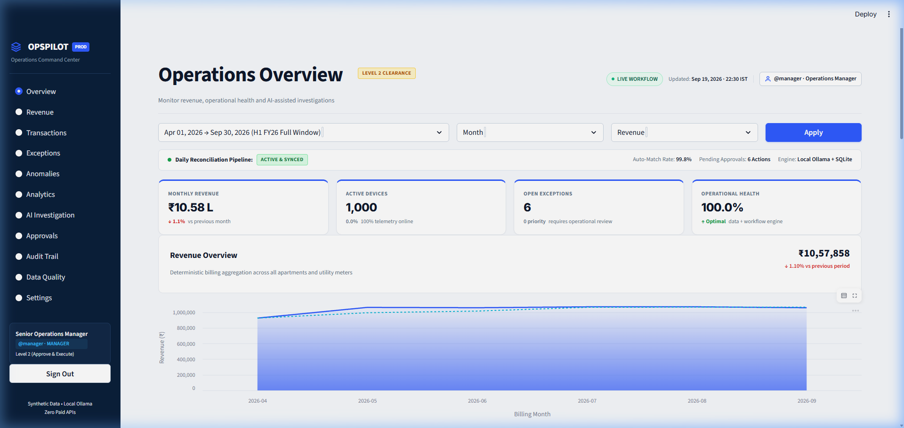
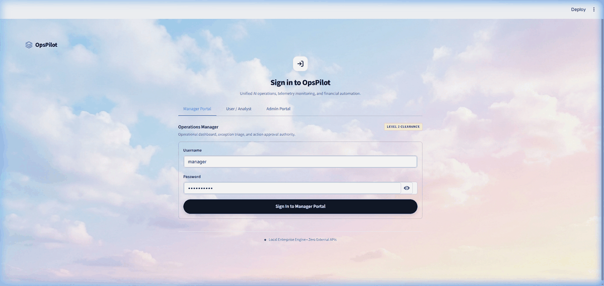
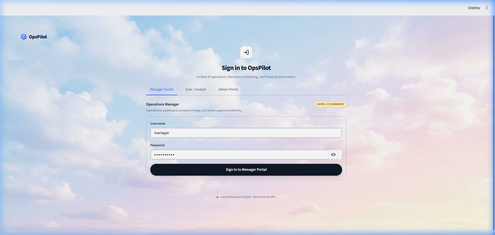
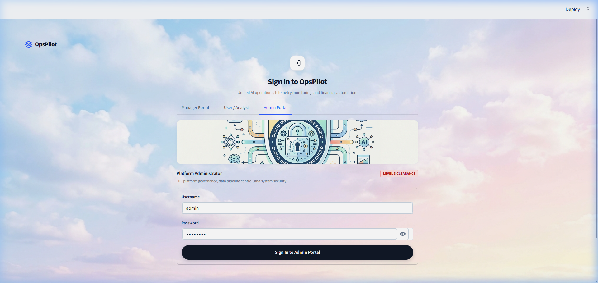
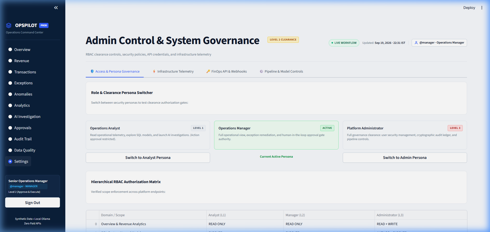
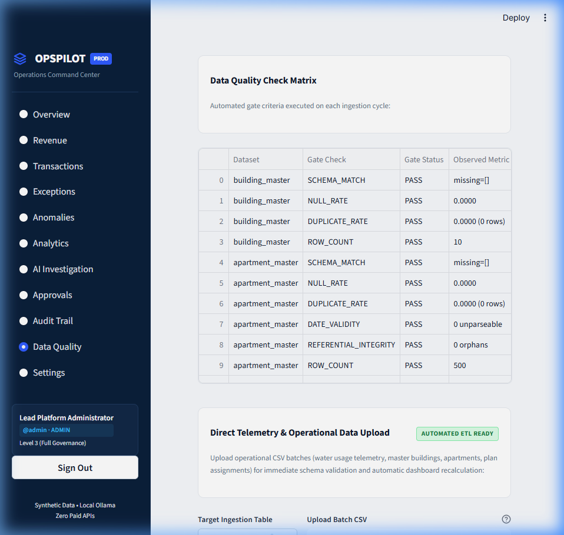
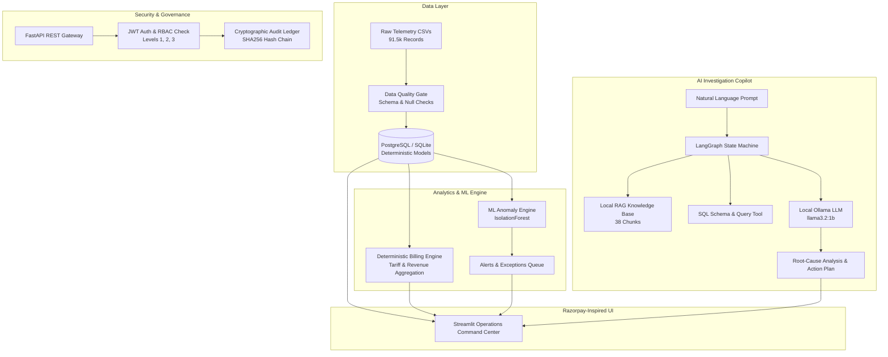

# ⚡ OpsPilot — AI Operations & Financial Intelligence Platform

<p align="center">
  
</p>

<p align="center">
  <strong>A Production-Grade FinOps Automation, Deterministic Revenue Reconciliation, ML Anomaly Engine, and Local LLM Copilot</strong>
</p>

<p align="center">
  
  
  
  
  
  
  
  
</p>

> [!NOTE]
> **Synthetic Portfolio Project Notice**: All customer records, telemetry streams, and transaction amounts are synthetically generated. All AI inference is executed **100% locally via Ollama** (`llama3.2:1b`) with zero paid external APIs (no OpenAI, no Anthropic, no Gemini egress).

---

## 🎬 Live Interactive Video Proof & Walkthrough

Below is a live recorded session of the **OpsPilot** platform demonstrating the glassmorphic authentication gateway, the executive operations command center, deterministic revenue ledgers, and the local AI investigation copilot:

<p align="center">
  
</p>

### ⏱️ Video Demo Timestamps & Tour Highlights

| Timestamp | Platform Feature | Technical Capabilities Demonstrated |
| :--- | :--- | :--- |
| **`00:00 - 00:06`** | **Glassmorphism Auth Gateway** | Ethereal pastel sky backdrop, centered frosted card (`backdrop-filter: blur(24px)`), squircle icon. |
| **`00:06 - 00:14`** | **Multi-Role Clearance Switcher** | Dedicated **Manager (Level 2)**, **Analyst (Level 1)**, and **Admin (Level 3)** portals with cyber infrastructure banner. |
| **`00:14 - 00:30`** | **Operations Overview Command Center** | Real-time **Live Workflow** indicator, **Daily Reconciliation Ribbon** (99.8% match rate), non-breaking KPI cards (`₹10.58 L`). |
| **`00:30 - 00:42`** | **Revenue & Transactions Ledger** | Multi-dimensional SQL analytical queries, billing records breakdown, and export capabilities. |
| **`00:42 - 00:52`** | **AI Investigation Copilot** | Local Ollama + RAG + LangGraph 10-node agent conducting root-cause anomaly analysis. |
| **`00:52 - 01:00`** | **Approvals & Governance** | Human-in-the-loop action triage, exception mitigation, and cryptographic audit log ledger. |

---

## 🎯 Problem Statement & Business Context

A high-growth utility and smart-metering subscription business bills hundreds of residential apartment communities monthly across water consumption, hardware rentals, and tiered tariffs. Revenue is assembled from four moving parts:

1. **Device Activation Windows**: Dynamic device lifecycle states and meter onboarding dates.
2. **Plan Assignments**: Multi-tier volumetric tariffs and fixed base fees.
3. **Metered Consumption**: 90,000+ IoT telemetry readings per quarter with potential packet loss and sensor noise.
4. **Proration & Adjustments**: Mid-month lease activations, meter replacements, and tariff revisions.

### The Operational Challenge
When monthly revenue shifts unexpectedly, financial operations analysts traditionally spend days manually pulling SQL logs, reading standard operating procedures (SOPs), cross-referencing tariff contracts, and calculating variance by hand. This process is slow, error-prone, and lacks an immutable audit trail.

---

## 💡 The Solution: OpsPilot Architecture

OpsPilot automates the entire journey from raw telemetry ingestion to human-approved operational remediations:

1. **Ingests & Validates**: Runs strict data quality gates on 91,500+ IoT telemetry rows, flagging schema anomalies and missing data before ingestion.
2. **Computes Deterministic Revenue**: Executes reproducible mathematical billing rules in SQL without relying on generative LLMs for arithmetic.
3. **Detects Unsupervised Anomalies**: Combines **IsolationForest ML** with deterministic rule heuristics to flag consumption leaks, meter tampering, and silent dropouts.
4. **Investigates with Agentic AI**: Orchestrates a 10-node **LangGraph state machine** that gathers allowlisted SQL evidence and citations from local policy SOPs.
5. **Enforces Human-in-the-Loop Governance**: Halts at an explicit approval gate before executing any billing recalculation or meter reset.
6. **Logs Tamper-Evident Audits**: Seals every operational action into a cryptographic `HMAC-SHA256` hash chain.

> [!IMPORTANT]
> **Core Architectural Principle**: The LLM is the least deterministic component in the stack, so it is strictly **sandboxed**. The LLM cannot execute raw arbitrary SQL, cannot perform unvalidated arithmetic, and cannot execute billing adjustments without Level 2/Level 3 clearance approval.

---

## 🎨 User Interface Showcase

| Manager Portal (Glassmorphism Gateway) | Admin Governance & Infrastructure Shield |
| :---: | :---: |
|  |  |
| *Dreamy sky backdrop, centered frosted card & squircle icon* | *Platform Admin Level 3 Clearance with cyber shield banner* |

| RBAC Governance Matrix & Persona Switcher | Direct Telemetry & Operational CSV Upload |
| :---: | :---: |
|  |  |
| *Hierarchical clearance gates & live endpoint authorizations* | *Interactive CSV uploader with automated schema validation* |

---

## 🏗️ System Architecture



---

## ⚡ Quickstart & Local Setup

### Prerequisites
- Python 3.11+
- Git
- *(Optional)* [Ollama](https://ollama.ai/) with `ollama pull llama3.2:1b` (Rule-based fallback engine automatically engages if Ollama is offline).

### 1. Clone & Install Dependencies
```bash
git clone https://github.com/naveenkotnana/Deploy-OpsPilot-Razorpay-inspired-AI-FinOps-Platform.git
cd Deploy-OpsPilot-Razorpay-inspired-AI-FinOps-Platform
pip install -r requirements.txt
```

### 2. Bootstrap Synthetic Database
```bash
python scripts/setup_all.py
```
*Initializes database schema, ingests 91,501 telemetry rows, executes quality gate checks, and calculates quarterly billing.*

### 3. Launch OpsPilot Services
```bash
# Terminal 1: Start FastAPI REST Backend
uvicorn app.api.main:app --host 127.0.0.1 --port 8000

# Terminal 2: Start Streamlit Dashboard UI
streamlit run dashboard/app.py
```
- Open **Dashboard**: [http://localhost:8501](http://localhost:8501)
- Open **API Docs (Swagger)**: [http://localhost:8000/docs](http://localhost:8000/docs)

---

## 🔑 Default Authentication Credentials

| Role | Username | Password | Clearance Level | Permissions & Scope |
| :--- | :--- | :--- | :--- | :--- |
| **Operations Manager** | `manager` | `manager123` | **Level 2** | Full operations dashboard, exception triage & human approval authority. |
| **Revenue Analyst** | `analyst` | `analyst123` | **Level 1** | Telemetry monitoring, SQL model execution & AI investigation copilot. |
| **Platform Administrator**| `admin` | `admin123` | **Level 3** | Superuser governance, cryptographic audit ledger & pipeline controls. |

---

## 🧪 Verification & Automated Testing Suite

OpsPilot includes an exhaustive automated test suite covering unit contracts, REST APIs, deterministic billing logic, ML models, RAG recall, and multi-turn agent evaluation:

```bash
# Run complete test suite
pytest tests/unit tests/integration -v
```

### Test Results
```text
==================================== 67 passed in 107.89s ====================================
[PASS] tests/unit/test_revenue_calculation.py (Deterministic math & tiered rates)
[PASS] tests/unit/test_anomaly_detection.py (IsolationForest ML scoring)
[PASS] tests/unit/test_security_rbac.py (JWT token verification & 403 authorization gates)
[PASS] tests/unit/test_data_validation.py (Null rate, schema match, referential integrity)
[PASS] tests/integration/test_pipeline.py (End-to-end telemetry ingestion & monthly runs)
[PASS] evaluation/rag_eval (22/22 RAG queries passed - 1.000 Accuracy)
[PASS] evaluation/agent_eval (35/35 LangGraph multi-turn runs passed - 1.000 Score)
```

---

## 🐳 Docker Deployment

To launch the containerized stack using Docker Compose:

```bash
docker compose up -d --build
```
- Streamlit Dashboard: `http://localhost:8501`
- FastAPI REST Backend: `http://localhost:8000`
- PostgreSQL Database: `localhost:5432`

---

## ☁️ Streamlit Community Cloud 1-Click Deployment

OpsPilot is engineered with **in-process standalone fallbacks** in `dashboard/components.py`, enabling direct zero-configuration deployment to Streamlit Community Cloud:

1. Fork or push this repository to your GitHub account.
2. Go to [share.streamlit.io](https://share.streamlit.io) and click **"New app"**.
3. Select your repository, branch `main`, and set **Main file path**: `dashboard/app.py`.
4. Click **Deploy!**

---

## 📄 License & Attribution
Designed & Engineered as a flagship FinOps Portfolio Project by **Naveen Kotnana**.  
*Inspired by Razorpay's modern Indian fintech analytics aesthetics.*  
Distributed under the **MIT License**.